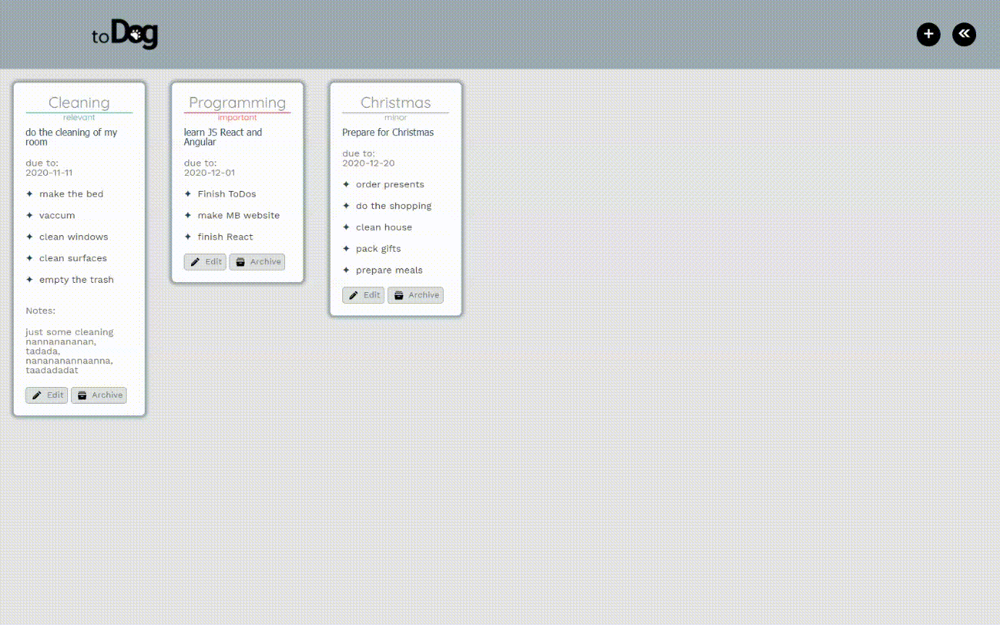
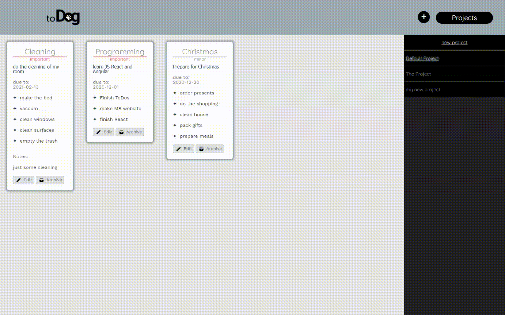

# toDog - custom todos

Test my [todos](https://wblachut.github.io/Todos_TheOdinProject/)!

##

## PROJECT: TODO LIST

Project is a part of The Odin Project [JavaScript learning curriculum](https://www.theodinproject.com/courses/javascript). To learn more open the [TOP assignment](https://www.theodinproject.com/courses/javascript/lessons/todo-list).

## Description

Simple todos website to store some **tasks** information. You can launch `add task` by pressing "+" button in top-left corner. If you do so you will be able to add task title, description, due-to date, bullets for checklist, notes, priority and project the task shall belong to. To display and add **projects** click the button just next to `add task button`. You can menage projects while adding new task.

After adding task, you can see it if you are in the proper project window. To switch to other project window just choose one from project list. You can make adjustments to task by editing them and archive them if they are not relevant anymore. Website is using LocalStorage to save application state. Application does not allow project removing so far!

## Concepts used and learned:

- ES6 Modules
- Factories
- Constructors
- CSS transitions
- LocalStorage

# Tools:

- Visual Studio Code
- Javascript
- Webpack
- ESLint
- Prettier

## Some concepts to apply in future:

- use Firebase or other type of storage
- make project removing possible
- fix saving all on multiple editing
  - (removing eventListeners from edit buttons after one of them is clicked)
  - (make saving only task for which save button was clicked)
- add bullet crossing out for finished things in task checklist
- add date functionality to have some nice timing features like display: `past date` or `deadline soon`
